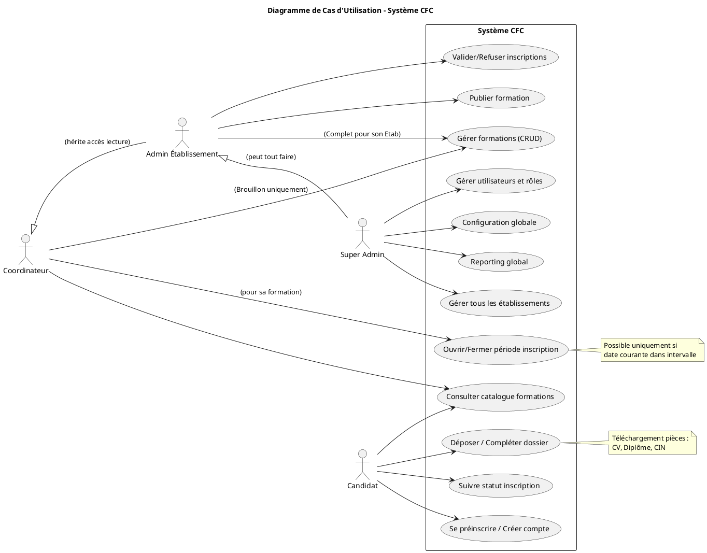
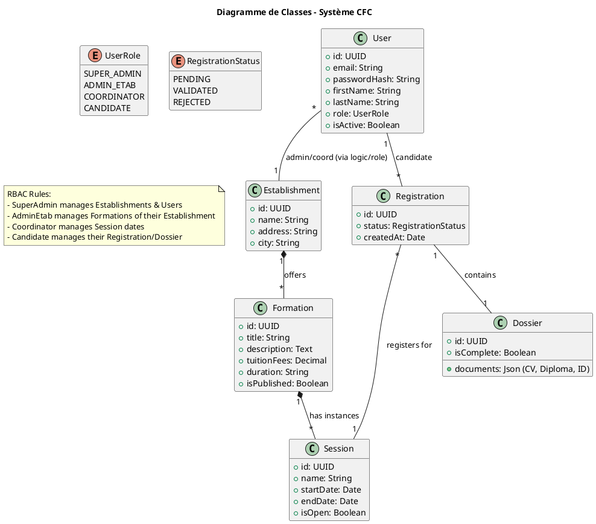
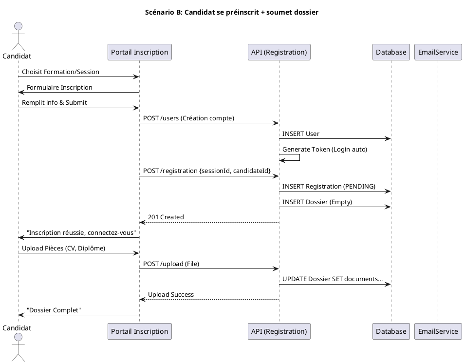
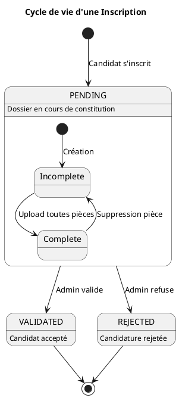
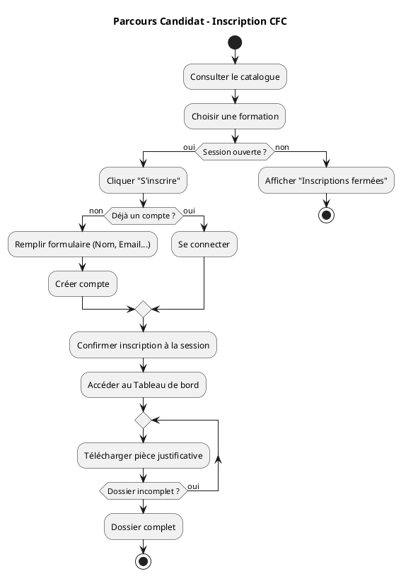

# Rapport de Projet : Système de Gestion des Centres de Formation Continue (CFC)

## 1. Introduction
Ce document présente l'architecture technique, la modélisation UML et les instructions de déploiement pour la plateforme de gestion des inscriptions aux formations continues (CFC). Le système permet aux candidats de postuler aux formations offertes par différents établissements (FST, ENCG, etc.) et aux administrateurs de gérer le cycle de vie des inscriptions.

## 2. Architecture Technique
Le projet repose sur une architecture moderne et conteneurisée :

*   **Backend** : NestJS (Node.js framework), TypeORM (ORM), PostgreSQL (Base de données).
*   **Frontend** : React avec Vite et TypeScript.
*   **Infrastructure** : Docker Compose pour l'orchestration des services (Base de données, API, Interface Utilisateur).

## 3. Modélisation UML
Voici les diagrammes PlantUML décrivant la structure et le comportement du système.

### 3.1 Diagramme de Cas d'Utilisation
Vue d'ensemble des acteurs et de leurs interactions avec le système.



### 3.2 Diagramme de Classes
Structure des données et relations entre les entités.



### 3.3 Diagramme de Séquence (Inscription Candidat)
Détail du flux d'inscription et de création de compte.
*(Extrait du fichier sequence_diagrams.puml)*



### 3.4 Diagramme d'États (Cycle de vie d'une Inscription)



### 3.5 Diagramme d'Activité (Parcours Candidat)



## 4. Correctifs Récents
Des améliorations majeures ont été apportées pour stabiliser l'application :
1.  **Résolution des dépendances circulaires** : Modification des entités `Formation` et `Session` pour éviter les boucles infinies lors de la sérialisation JSON (Erreur 500). Ajout de colonnes d'ID explicites (`establishmentId`, `formationId`).
2.  **Gestion des dépendances Backend** : Correction des modules NestJS pour assurer que tous les repositories (`Registration`, `Dossier`) sont correctement injectés, résolvant les crashs au démarrage.
3.  **Conteneurisation complète** : Configuration validée de `docker-compose` pour lancer PostgreSQL, le Backend et le Frontend en une seule commande.

## 5. Guide de Démarrage
Pour lancer le projet localement :

1.  **Prérequis** : Docker et Docker Compose installés.
2.  **Démarrage** :
    ```bash
    docker compose up -d
    ```
3.  **Accès** :
    *   Frontend : http://localhost:5173
    *   Backend API : http://localhost:3000
